# SincroNyaa — Seudocódigo

---

## 1. Seudocódigo clásico (estilo algoritmo)

```
ALGORITMO SincronizarSubtitulo(video_antiguo, video_nuevo, subtitulo, salida, keyframes_antiguo=NULO, keyframes_nuevo=NULO)

  // ── FASE 0: validación y arranque en la ventana principal ──────────
  SI ffmpeg no está en el PATH ENTONCES
    MOSTRAR error crítico "ffmpeg no encontrado" (al abrir la ventana)
  FIN SI

  AL PRESIONAR "Sincronizar":
    SI falta video_antiguo, video_nuevo, subtitulo o salida ENTONCES
      MOSTRAR advertencia "Debes seleccionar todos los archivos" ; TERMINAR
    FIN SI
    SI video_antiguo, video_nuevo o subtitulo no son archivos válidos ENTONCES
      MOSTRAR advertencia específica del campo inválido ; TERMINAR
    FIN SI
    SI la carpeta de salida no existe ENTONCES
      MOSTRAR advertencia "El directorio de salida no existe" ; TERMINAR
    FIN SI
    INICIAR SyncWorker(...) EN HILO SEPARADO
    // la ventana principal queda escuchando señales: progress, log, finished, error


  FUNCION SyncWorker.run()
    cancelado ← FALSO   // flag cooperativo, ver notas de cancelación al final

    // ── FASE 1: extracción de audio ──────────────────────────────────
    audio_ant ← ExtraerAudio(video_antiguo)   // ffmpeg → WAV mono 16kHz
    SI cancelado ENTONCES DEVOLVER FIN SI
    audio_nue ← ExtraerAudio(video_nuevo)
    SI cancelado ENTONCES DEVOLVER FIN SI
    // ExtraerAudio: si ffmpeg devuelve código de error, LANZAR excepción
    // con las últimas 8 líneas de stderr (motivo real del fallo)

    // ── FASE 2: características de audio ─────────────────────────────
    feat_ant ← ComputeFeatures(audio_ant)
    feat_nue ← ComputeFeatures(audio_nue)
    SI cancelado ENTONCES DEVOLVER FIN SI

    FUNCION ComputeFeatures(audio):
      mel   ← normalizar(mel_spectrogram(audio))     // energía espectral
      onset ← normalizar(onset_strength(audio))       // fuerza de ataques sonoros
      // sin canal de chroma: aporta ruido en contenido hablado
      DEVOLVER mel * 0.3 + onset * 0.7                // onset domina, es mas discriminativo
    FIN FUNCION

    // ── FASE 3: offset por ventanas deslizantes ──────────────────────
    ventanas ← []
    PARA CADA ventana de 30s (paso 10s) EN feat_ant HACER
      region_busqueda ← feat_nue recortado a [ventana ± 300s]
      SI region_busqueda es mas corta que la ventana ENTONCES CONTINUAR FIN SI
      corr ← CorrelacionCruzadaFFT(region_busqueda, ventana)
      offset ← lag_del_pico_de(corr) convertido a segundos
      confianza ← pico_de(corr) / desviacion_estandar(corr)
      AGREGAR (tiempo_ventana, offset, confianza) A ventanas
    FIN PARA

    // ── FASE 4: agrupar en segmentos ─────────────────────────────────
    segmentos ← ClusterOffsets(ventanas)

    FUNCION ClusterOffsets(ventanas):
      fiables ← [v EN ventanas SI v.confianza >= 3.0]
      SI fiables está vacío ENTONCES
        SI ventanas no está vacío ENTONCES
          DEVOLVER [la ventana de mayor confianza, como único segmento degenerado]
        SINO
          DEVOLVER []   // ningún resultado en absoluto
        FIN SI
      FIN SI

      segmento_actual ← primera ventana fiable
      PARA CADA ventana EN fiables[1:] HACER
        salto_offset    ← |ventana.offset - promedio_ponderado(segmento_actual)| > 1.0s
        hueco_temporal  ← (ventana.tiempo - anterior.tiempo) > 20.0s   // señal de OP/ED
        SI salto_offset O hueco_temporal ENTONCES
          CERRAR segmento_actual (offset = promedio ponderado por confianza)
          ABRIR nuevo segmento_actual CON ventana
        SINO
          ACUMULAR ventana EN segmento_actual
        FIN SI
      FIN PARA
      CERRAR último segmento_actual
      DEVOLVER lista_de_segmentos
    FIN FUNCION

    SI segmentos está vacío ENTONCES
      EMITIR error "No se encontraron segmentos fiables. Comprueba que los videos comparten contenido."
      TERMINAR
    FIN SI

    // ── FASE 5: aplicar offset por segmento al subtítulo ─────────────
    subs ← Cargar(subtitulo)
    fallback ← offset del primer segmento
    PARA CADA linea EN subs HACER
      offset ← offset del segmento cuyo rango [inicio-5s, fin+5s] contiene linea.inicio
               SINO fallback
      linea._inicio_original ← linea.inicio   // para el snap de FASE 7
      linea._fin_original    ← linea.fin
      linea.inicio ← linea.inicio + offset    // nunca negativo
      linea.fin    ← linea.inicio + duracion_original
    FIN PARA
    SI cancelado ENTONCES DEVOLVER FIN SI

    // ── FASE 6: resolver keyframes de cada video ─────────────────────
    (kf_ant, _)      ← ResolverKeyframes(video_antiguo, keyframes_antiguo)
    (kf_nue, ts_nue) ← ResolverKeyframes(video_nuevo, keyframes_nuevo)

    FUNCION ResolverKeyframes(video, archivo_keyframes):
      SI archivo_keyframes fue cargado ENTONCES
        frames ← ParsearArchivoKeyframes(archivo_keyframes)
        // detecta automáticamente formato Aegisub/wwxd/scxvid/vstools
        // o XviD 2pass stats
        INTENTAR
          timestamps ← TimestampsRealesViaVapourSynth(video)   // ver FASE 6a
          kf_ms ← [timestamps[f] PARA CADA f EN frames SI f es índice válido]
          DEVOLVER (kf_ms, timestamps)
        CAPTURAR error DE VapourSynth
          MOSTRAR "VapourSynth falló: {error}. Cayendo a detección automática."
          DEVOLVER (ExtraerKeyframesFfprobe(video), [])
        FIN INTENTAR
      SINO
        DEVOLVER (ExtraerKeyframesFfprobe(video), [])
      FIN SI
    FIN FUNCION

    // (FASE 6a) TimestampsRealesViaVapourSynth: ejecuta un subproceso
    // Python aislado (VapourSynth es inestable en un QThread secundario)
    // que prueba el filtro lsmas (LWLibavSource) y si no está disponible
    // o falla, prueba ffms2 (Source). Para cada frame intenta leer la
    // propiedad _AbsoluteTime (soporta fps variable real, ej. tras IVTC);
    // sin esa propiedad, cae a un cálculo CFR puro por fps_num/fps_den
    // del clip; sin fps válido, aproxima a 23.976fps. Antes de invocar el
    // subproceso, registra si ya existían los archivos de índice (.lwi
    // para lsmas, .ffindex para ffms2) al lado del video; al terminar
    // (éxito o error) borra solo los que se generaron en esta corrida.

    // ── FASE 7: snap de start/end a keyframes ────────────────────────
    SI kf_ant no está vacío Y kf_nue no está vacío ENTONCES
      fallback_frame_ms ← 42   // ~23.976fps
      SI ts_nue está vacío ENTONCES
        (fps_num, fps_den) ← FpsRealDe(video_nuevo)   // ffprobe
        SI fps_num > 0 ENTONCES fallback_frame_ms ← 1000 * fps_den / fps_num FIN SI
      FIN SI
      (n_starts, n_ends) ← SnapAKeyframes(subs, kf_ant, kf_nue, ts_nue, fallback_frame_ms)
    SINO
      MOSTRAR "Sin keyframes disponibles, snap omitido."
    FIN SI

    FUNCION SnapAKeyframes(subs, kf_ant, kf_nue, ts_nue, fallback_frame_ms):
      umbral ← 170ms

      // pares pegados: end de una línea y start de otra ancladas al
      // mismo keyframe viejo (convención de fansub para evitar
      // parpadeo en cortes de escena) deben quedar pegadas también
      // en el resultado
      pegadas ← DetectarParesPegados(subs, kf_ant, umbral)

      PARA CADA linea EN subs HACER
        SI linea._inicio_original estaba a <= umbral de un keyframe viejo ENTONCES
          candidato ← keyframe mas cercano en kf_nue al linea.inicio ya desplazado
          SI candidato a <= umbral ENTONCES
            linea.inicio ← candidato (truncado a centésimas, floor)
          FIN SI
        FIN SI
        SI linea._fin_original estaba a <= umbral de un keyframe viejo ENTONCES
          candidato ← keyframe mas cercano en kf_nue al linea.fin ya desplazado
          SI candidato a <= umbral ENTONCES
            SI linea está en pegadas ENTONCES
              linea.fin ← candidato (mismo valor que tendría un start)
            SINO
              // end es exclusivo en fansub: debe terminar antes del
              // frame siguiente, por eso se ancla al frame ANTERIOR
              // al keyframe (redondeado hacia arriba a centésimas)
              frame_anterior ← FrameAnteriorA(candidato, ts_nue, fallback_frame_ms)
              linea.fin ← frame_anterior (ceil a centésimas)
            FIN SI
          FIN SI
        FIN SI
      FIN PARA
      DEVOLVER (cantidad_starts_ajustados, cantidad_ends_ajustados)
    FIN FUNCION

    // ── FASE 8: metadatos del subtítulo ──────────────────────────────
    subs.aegisub_project["Video File"] ← video_nuevo
    subs.aegisub_project["Audio File"] ← video_nuevo
    // se agregan aunque el .ass original no tuviera esos campos

    // ── FASE 9: guardar ────────────────────────────────────────────────
    Guardar(subs, salida)
    SI cancelado ENTONCES DEVOLVER FIN SI
    EMITIR finished(salida)

  FIN FUNCION


  // ═══════════════════════════════════════════════════════════════════
  // Ventana principal: recibe las señales de SyncWorker
  // ═══════════════════════════════════════════════════════════════════
  AL RECIBIR progress(valor):
    ACTUALIZAR barra de progreso

  AL RECIBIR log(mensaje):
    AGREGAR mensaje al cuadro de log

  AL RECIBIR finished(salida):
    MOSTRAR "¡Listo! Subtítulo guardado en: {salida}"
    REHABILITAR controles

  AL RECIBIR error(mensaje_con_traceback):
    AGREGAR mensaje al log
    MOSTRAR error crítico (QMessageBox.critical) con el traceback completo
    REHABILITAR controles

  AL PRESIONAR "Cancelar":
    cancelado ← VERDADERO
    // cooperativo: el paso pesado en curso (ffmpeg, VapourSynth, cálculo
    // de correlación) termina igual antes de que el flag se note, no hay
    // interrupción instantánea
    REHABILITAR controles

FIN ALGORITMO
```

---

## 2. Lenguaje natural paso a paso

**1. Antes de arrancar**, la ventana principal valida que los cuatro campos obligatorios (video viejo, video nuevo, subtítulo, salida) estén completos, que video viejo/nuevo/subtítulo sean archivos que realmente existen, y que la carpeta de destino de la salida exista — cualquier fallo muestra una advertencia específica de cuál campo está mal y no llega a arrancar el proceso. Si todo está bien, se lanza un `SyncWorker` en un hilo (`QThread`) separado, y la ventana principal se limita a escuchar sus señales (`progress`, `log`, `finished`, `error`).

**2. Se extrae el audio de ambos videos** con ffmpeg, como WAV mono a 16kHz. Si ffmpeg devuelve un código de error, ya no se descarta el motivo (como en versiones anteriores): se captura el stderr y las últimas líneas se incluyen en el mensaje de error, para saber si el problema fue un códec no soportado, un archivo corrupto, etc.

**3. Se calculan las características de cada audio** combinando dos descriptores: mel-spectrogram (energía espectral, peso 0.3) y onset strength (fuerza de los "ataques" sonoros — inicios de diálogo, efectos, golpes; peso 0.7, es el más discriminativo). El canal de chroma que existía en versiones anteriores fue eliminado: agregaba ruido en contenido hablado sin mejorar la detección de offset.

**4. En vez de un único offset global**, se calcula un offset local cada 10 segundos usando ventanas de 30 segundos: para cada ventana del audio viejo, se busca su mejor coincidencia dentro de una región de ±300 segundos del audio nuevo (no en todo el audio, para acotar el costo), vía correlación cruzada FFT. Cada ventana obtiene además una confianza (el pico de correlación normalizado por la desviación estándar de la señal completa de correlación).

**5. Las ventanas con confianza suficiente (≥3.0) se agrupan en segmentos** de offset estable. Un segmento nuevo arranca cuando el offset salta más de 1 segundo respecto al promedio acumulado del segmento actual, o cuando hay un hueco temporal de más de 20 segundos entre ventanas consecutivas fiables — esto último es la señal típica de un OP/ED con offset distinto al resto del episodio, donde las ventanas de esa zona no llegan al umbral de confianza. El offset final de cada segmento es el promedio ponderado por confianza de las ventanas que lo componen.

**6. Si ninguna ventana alcanza el umbral de confianza**, se usa igual la de mayor confianza disponible como único segmento (mejor esfuerzo, degradado pero no vacío); si no hubo ninguna ventana en absoluto (por ejemplo, audio demasiado corto), el proceso termina con un error explícito pidiendo comprobar que los videos comparten contenido.

**7. Cada línea del subtítulo recibe el offset del segmento** cuyo rango cubre su tiempo de inicio (con un margen de ±5 segundos en los bordes, para tolerar imprecisiones del clustering); si ninguno la cubre, se usa el offset del primer segmento como respaldo. Antes de aplicar el offset, se guarda el tiempo original de cada línea (pre-offset) — lo va a necesitar el paso de snap a keyframes más adelante.

**8. Se resuelven los keyframes de cada video** (el mismo proceso corre una vez para el video viejo y otra para el nuevo). Si el usuario cargó un archivo de keyframes para ese video, se parsea (soporta el formato estándar de Aegisub/wwxd/scxvid/vstools y el de estadísticas XviD 2-pass) y se intenta obtener los timestamps reales de cada frame del video vía VapourSynth.

**9. VapourSynth corre en un subproceso Python aislado**, no dentro del hilo del worker, porque es inestable si se lo llama desde un `QThread` secundario (puede matar el proceso sin avisar). El subproceso prueba primero el filtro `lsmas`, y si no está disponible o falla, prueba `ffms2`; para cada frame intenta leer su timestamp real (soporta fps variable, por ejemplo tras IVTC), con dos niveles de respaldo si esa información no está disponible. Si VapourSynth tiene éxito, los números de frame del archivo de keyframes se convierten a milisegundos reales con esa tabla. Si falla por cualquier motivo, se cae a la detección automática por ffprobe para ese video — sin timestamps reales de frame.

**10. La primera vez que lsmas o ffms2 abren un video generan un archivo de índice al lado** (`.lwi` o `.ffindex`) para no reindexar en corridas futuras — como este programa no vuelve a necesitar ese video en la misma sesión, el índice generado en esta corrida se borra al terminar (haya éxito o error). Si el índice ya existía de antes (por ejemplo, de otro uso de VapourSynth fuera de este programa), se deja intacto.

**11. Si el usuario no cargó un archivo de keyframes para un video**, se extraen automáticamente vía ffprobe (buscando frames marcados como tipo I), sin pasar por VapourSynth en absoluto.

**12. Si ambos videos (viejo y nuevo) terminaron con al menos un keyframe**, se hace el snap: para cada línea cuyo start y/o end *original* (antes del offset) estaba a 170ms o menos de un keyframe del video viejo, se busca el keyframe más cercano en el video nuevo al tiempo ya desplazado, y si también cae dentro del umbral, el tiempo se ancla a ese keyframe. El start se ancla directamente al keyframe; el end, siguiendo la convención de fansub de que el end es exclusivo, se ancla al frame inmediatamente *anterior* al keyframe (para que la línea termine antes de que arranque la escena nueva).

**13. Si el end de una línea y el start de otra estaban anclados al mismo keyframe del video viejo** (convención común para evitar parpadeo en cortes de escena), ambos quedan con el mismo valor en el video nuevo, sin dejar un hueco intermedio entre las dos líneas.

**14. Cuando no hay timestamps reales de frame del video nuevo** (porque no se cargó archivo de keyframes, o porque VapourSynth falló), el cálculo del "frame anterior" para el end usa un valor aproximado: la duración de un frame al fps real del video nuevo (consultado vía ffprobe), o ~42ms (23.976fps) si ni siquiera eso se pudo determinar.

**15. Si alguno de los dos videos no produjo ningún keyframe**, el snap se omite por completo y el subtítulo queda solo con el offset por segmento aplicado.

**16. Antes de guardar**, se actualizan los campos `Video File` y `Audio File` del subtítulo para que apunten al video nuevo — se agregan aunque el `.ass` original no tuviera esa sección, para que abrirlo en Aegisub cargue automáticamente el video correcto sin tener que hacerlo a mano.

**17. El subtítulo se guarda en la ruta de salida** y se muestra un mensaje de éxito. En cualquier punto del proceso, cancelar es cooperativo: se revisa un flag entre pasos, no corta un paso pesado (extracción de audio, VapourSynth, cálculo de correlación) a mitad de camino — el paso en curso termina igual antes de que se note la cancelación. Cualquier excepción no capturada en el flujo entero se atrapa una sola vez, al nivel más alto, y se muestra al usuario con el traceback completo (no solo el mensaje), para poder diagnosticar en qué paso exacto falló.

---

## 3. Diagrama de flujo (mermaid)

```mermaid
flowchart TD
    A(["Usuario carga video viejo, video nuevo, subtítulo y presiona 'Sincronizar'"]) --> B{"¿Campos completos, archivos válidos y carpeta de salida existente?"}
    B -->|No| ERR0["⚠️ Advertencia con el campo inválido específico"]
    B -->|Sí| C["Extraer audio de ambos videos (ffmpeg → WAV mono 16kHz)"]
    C -->|"ffmpeg falla"| ERRA["Error con el motivo real (últimas líneas de stderr)"]
    C --> D["Calcular features: mel-spectrogram (0.3) + onset strength (0.7), sin chroma"]
    D --> E["Ventanas deslizantes de 30s (paso 10s): correlación FFT contra el audio nuevo (±300s), confianza por desviación estándar"]
    E --> F["Agrupar ventanas fiables (confianza ≥ 3.0) en segmentos"]
    F --> G{"¿Salto de offset > 1.0s o hueco temporal > 20.0s? (por cada ventana consecutiva)"}
    G -->|Sí| G1["Cerrar segmento actual, abrir uno nuevo"]
    G -->|No| G2["Acumular ventana en el segmento actual (offset ponderado por confianza)"]
    G1 --> H
    G2 --> H
    H{"¿Hay al menos un segmento? (sin ninguna ventana fiable, se usa la de mayor confianza como segmento único)"}
    H -->|No, ninguna ventana en absoluto| ERRB["Error: 'No se encontraron segmentos fiables'"]
    H -->|Sí| I["Aplicar el offset del segmento correspondiente a cada línea según su inicio (margen ±5s); guardar tiempos originales pre-offset"]

    I --> J["Resolver keyframes (se repite igual para video viejo y video nuevo)"]
    J --> K{"¿El usuario cargó un archivo de keyframes para este video?"}
    K -->|Sí| L["Parsear archivo (formato Aegisub/wwxd/scxvid/vstools o XviD 2pass)"]
    L --> M["Intentar timestamps reales de frame vía VapourSynth (lsmas o ffms2, subproceso aislado)"]
    M -->|Éxito| N["Convertir números de frame a ms con timestamps reales; borrar el índice .lwi/.ffindex generado en esta corrida"]
    M -->|"VapourSynth falla"| O["Log: 'VapourSynth falló, cayendo a detección automática'"]
    K -->|No| P["Extraer keyframes automáticamente vía ffprobe (frames tipo I)"]
    O --> P
    N --> Q
    P --> Q

    Q{"¿Ambos videos produjeron al menos un keyframe?"}
    Q -->|No| R["Log: 'Sin keyframes disponibles, snap omitido'"]
    Q -->|Sí| S{"¿Hay timestamps reales de frame del video nuevo?"}
    S -->|No| S1["Fallback de duración de frame por fps real del video nuevo (ffprobe), o ~42ms si no se pudo determinar"]
    S -->|Sí| T
    S1 --> T["Detectar pares de líneas 'pegadas' (end de una y start de otra ancladas al mismo keyframe viejo)"]
    T --> U["Para cada línea: si start/end original estaba a ≤170ms de un keyframe viejo, buscar el más cercano en el video nuevo"]
    U --> U1{"¿Ese end está 'pegado' al start de otra línea?"}
    U1 -->|Sí| U2["end = mismo valor que tendría un start"]
    U1 -->|No| U3["end = frame inmediatamente anterior al keyframe (convención de end exclusivo)"]
    U2 --> V
    U3 --> V
    R --> V

    V["Actualizar Video File / Audio File del subtítulo al video nuevo"]
    V --> W["Guardar subtítulo sincronizado"]
    W --> X(["Mostrar éxito al usuario"])
```



(En cualquier punto del proceso, cancelar o un error irrecuperable cortan el flujo — no representados en el diagrama para no saturarlo; ver la nota de cancelación cooperativa en la sección 2.)
